# Follow these instructions
Note: Clone the main repo: https://github.com/microsoft/Build26-LAB501-from-zero-to-deployed-on-azure-with-ai-agents.git

First of all, sign in to https://github.com/enterprises/skillable-events/sso
using the Username and Password provided in the lab. 

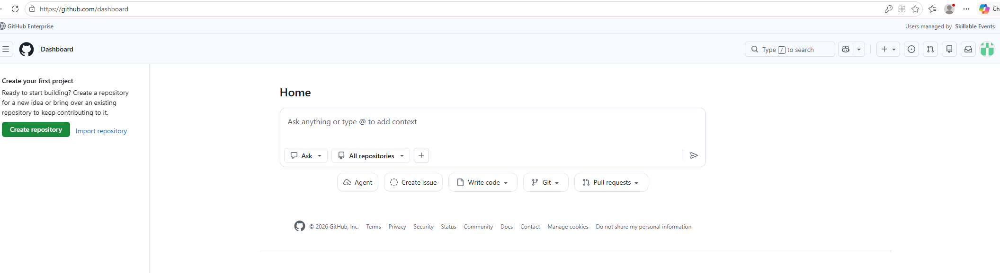

Then go to the terminal and log in to the Azure account

```
az login
```
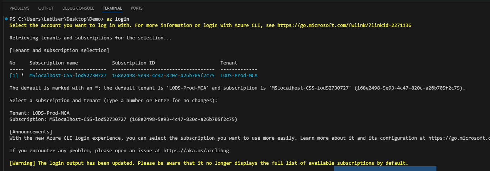

azd auth login

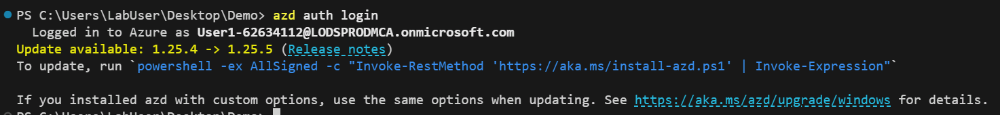


# Login to GitHub Copilot CLI

```
copilot
```
Choose Yes to continue.

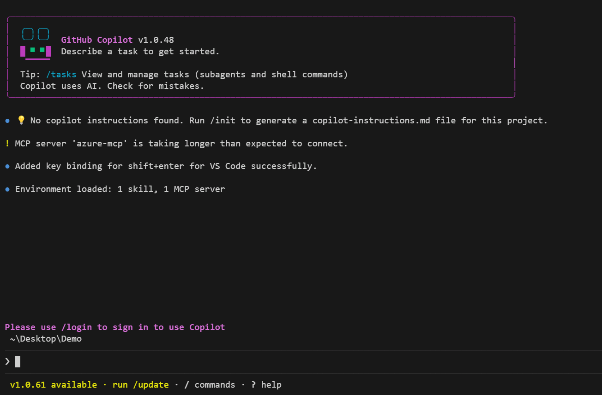

Then log in

```
/login
```

When prompted, select 'GitHub.com' to log into the account. Copilot will prompt you to enter any key to open a browser to complete the login. Follow the instructions in Copilot to complete authorization using the signed-in account.

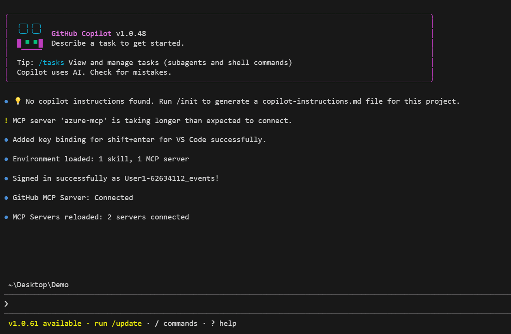


### Disable Rubberduck Agent (not needed here)

Use the following prompt in Copilot to disable the Rubberduck agent in Copilot CLI, as it's not needed for the lab session:

Say to Copilot
 Update the settings.json for Copilot CLI to disable rubber duck with this: "builtInAgents": {"rubberDuck": false},

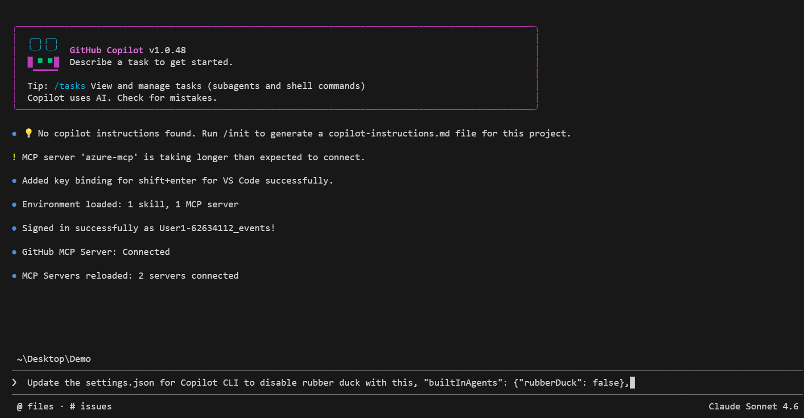

Then say "Yes" to confirm the change.

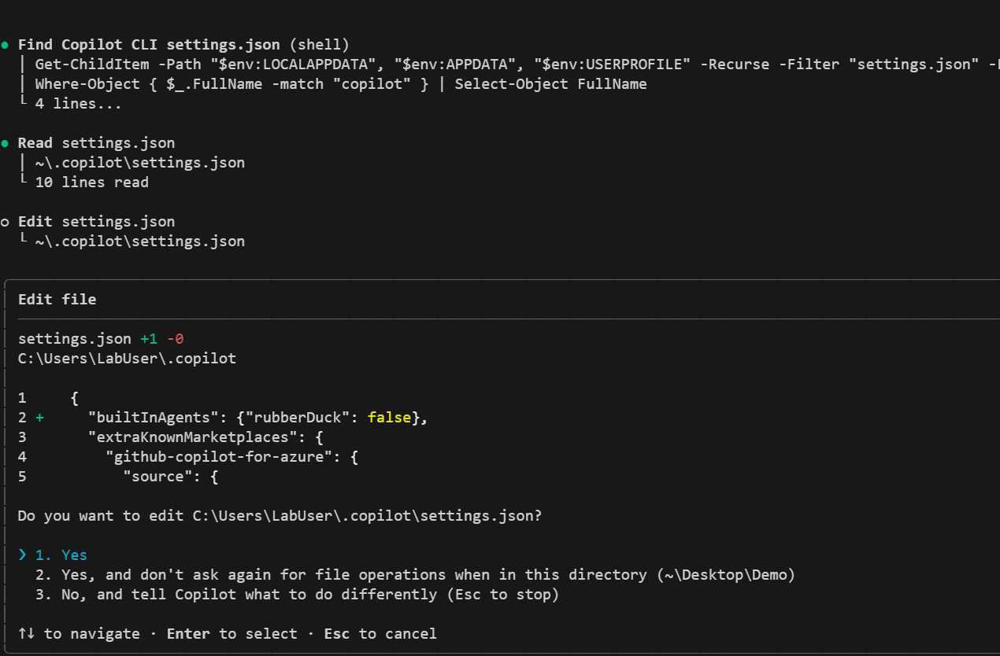
Once done, the agent will be disabled, and you will see the following message:


## Install Azure Sklills Plugin

Add the Microsoft marketplace:
```
/plugin marketplace add microsoft/azure-skills
```

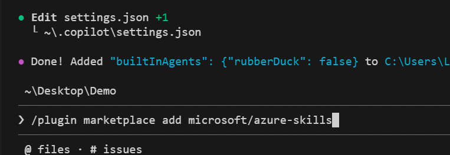

```
/plugin install azure@azure-skills 
/mcp reload
```
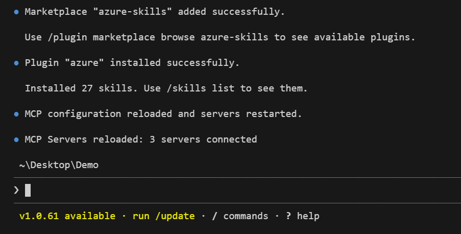


Close the terminal now!

# Get started with the Starter App

### Clone the Starter App

```
git clone https://github.com/microsoft/Build26-LAB501.git
cd Build26-LAB501
```

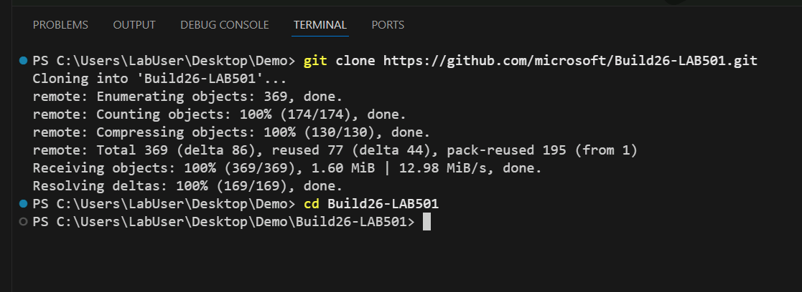

## Copy the starter app

```
Copy-Item -Recurse src lego-set-browser
cd lego-set-browser
git config --global user.name "Your Name"
git config --global user.email "you@example.com"
git init
git add -A
git commit -m "init"
```

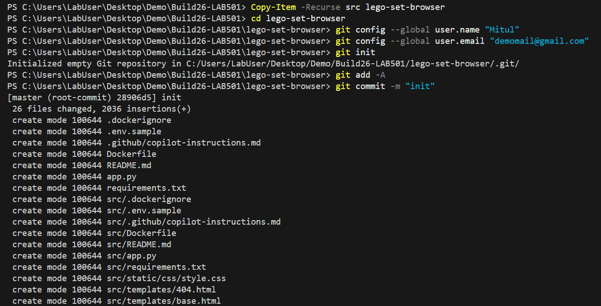

# Ship it and Harden it

If you're not already in the LEGO-set-browser directory, cd into it, then use the prompt below to start a Copilot session in yolo mode.

```
copilot --yolo
```

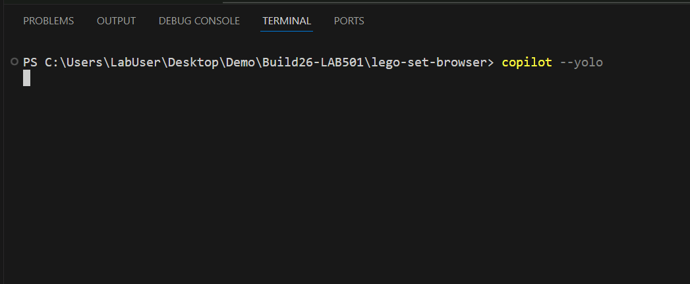

Then paste this instruction

```
  Create and deploy 2 Azure services 
   	
   **Environment:**
   - Subscription: Current subscription
   - Create a new resource group: rg-lego-set-browser-dev
   - Region: West US 3
   
   **Existing Cosmos DB (do NOT create a new one):**
   - Look for the existing cosmos DB in the current subscription
   - Database: LegoDatabase / Container: legoSets
   
   **1. Python Azure Function App** — HTTP POST trigger on Flex Consumption (FC1):
   - Accepts JSON array of LEGO sets; batch-upserts to Cosmos DB above
   - Fields: set_number (→ id), name, theme_name, year_released, number_of_parts, type, image_url
   - User-assigned managed identity for Cosmos DB (Built-in Data Contributor)
   
   **2. Flask app in this folder → Azure Container Apps:**
   - Name: ca-web-lego-<XXXX>
   - Already uses DefaultAzureCredential + env vars COSMOS_ENDPOINT, COSMOS_DATABASE, COSMOS_CONTAINER
   - System-assigned managed identity for Cosmos DB (Built-in Data Reader)

```

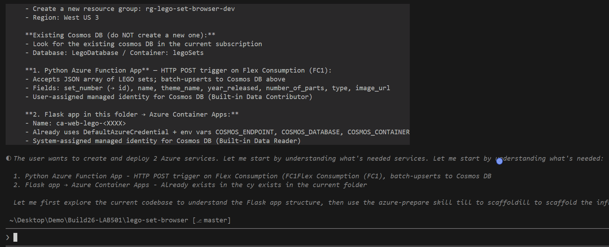

This single prompt triggers a three-skill chain — watch Copilot invoke 

azure-prepare activates first
azure-validate activates next
azure-deploy activates last


## Harden it

Review the generated Bicep files in your infra/ directory. Depending on how Azure-Prepare ran, it may have already applied some security hardening during generation. Your job is to audit what the AI did and didn't do.

Paste the following prompt in Copilot:

```
Review my deployed Container App infrastructure for production readiness gaps. Check for managed identity, Cosmos DB RBAC access (instead of keys), VNet integration, diagnostic settings, and health probes.
```

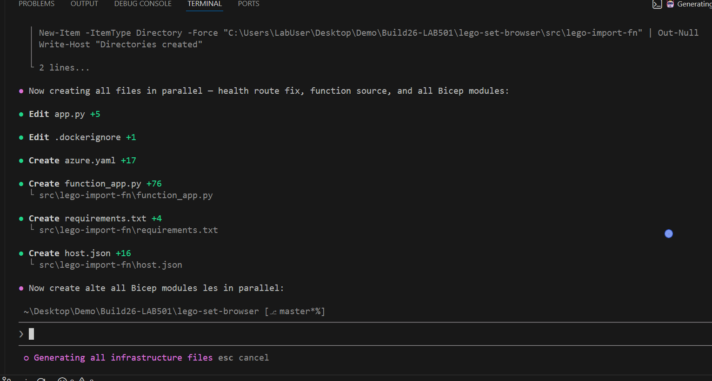

Also add these

```
Visualize the resources in my resource group as an architecture diagram.
```
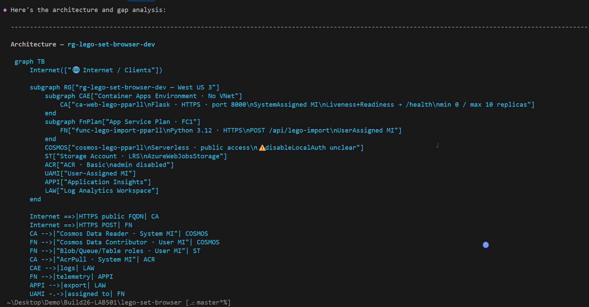

```
What's missing from this architecture for a production deployment? The app also connects to an existing Cosmos DB for its data.
```
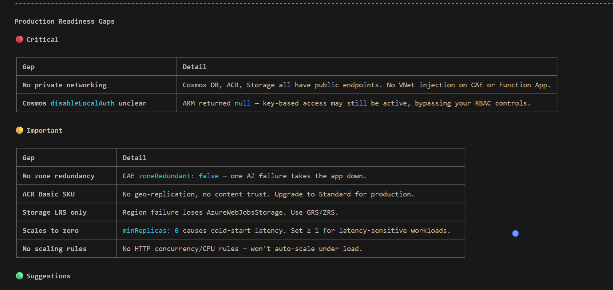

# Break it and Triage it

### Introduce a failure

```
az containerapp ingress update --name <app> -g <rg> --target-port 9999
```
Replace <app> and <rg> with the name of the Container app and resource group.

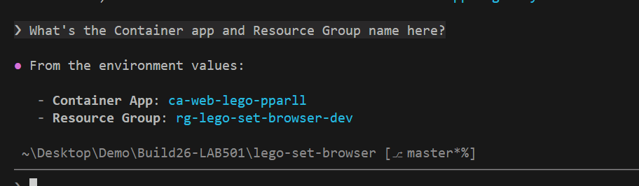

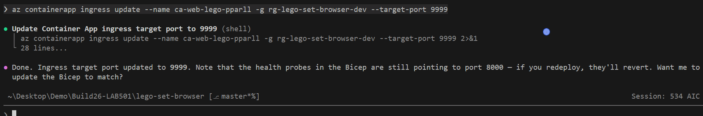

### Check the error with AI

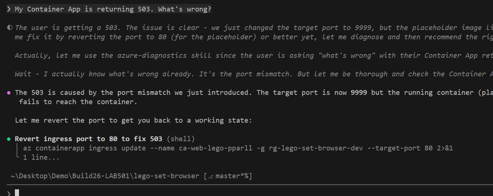

### Then apply the changes

```
az containerapp ingress update --name <app> -g <rg> --target-port 8000
```

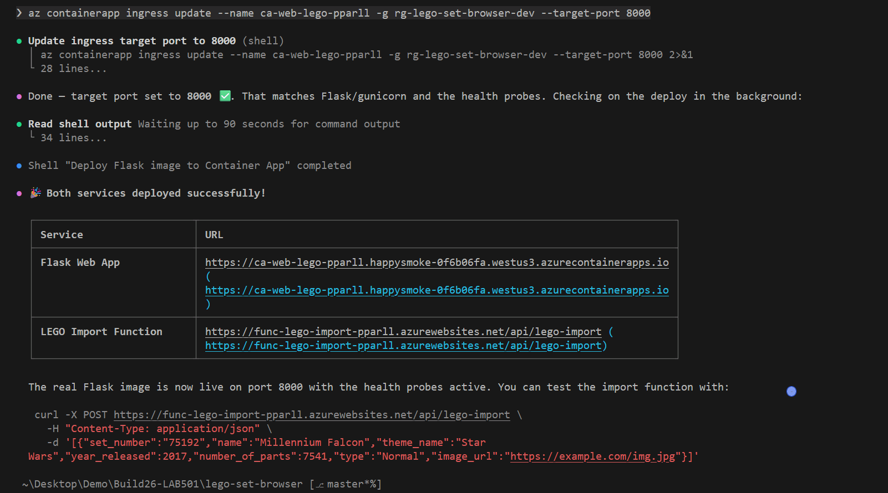

# Investigate It & Operationalize It


### Post-Mortem via KQL
```
Query the Log Analytics workspace for my Container App. Show me what happened during the port mismatch incident.
```
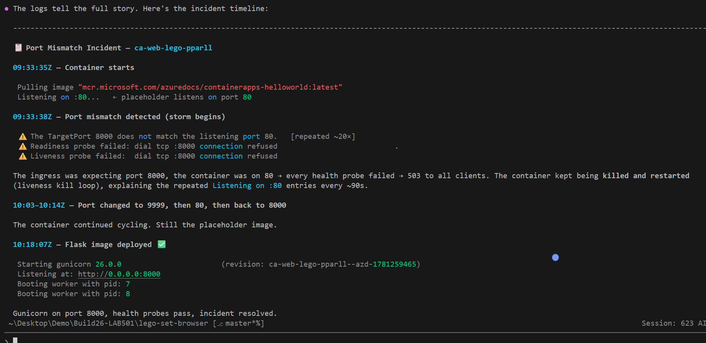

### Operationalize It

Say this to Copilot 

```
Create a KQL alert rule that fires when ProbeFailed events appear in the Container App system logs.
```
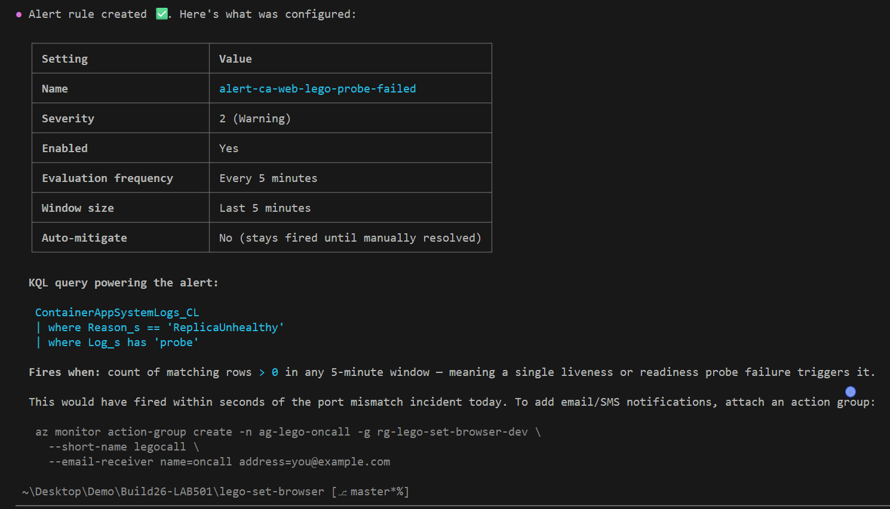

Then ask
```
What other alert rules should I have for a production Container App backed by Cosmos DB?
```
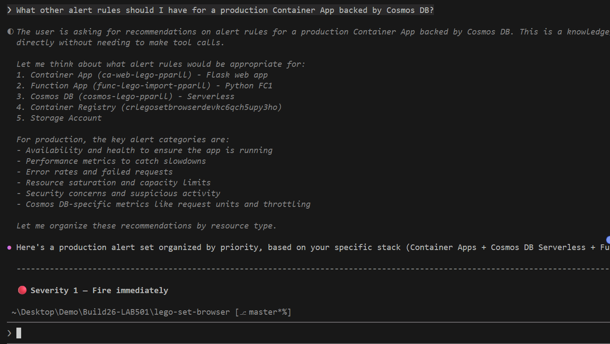

### Run the app

Go to lego-set-browser folder on a different terminal

cd Build26-LAB501/lego-set-browser
python app.py


### Correct the COSTMOS_ENDPOINT in the .env file

Ask the copilot to share the COSMOS_ENDPOINT from the Azure portal.

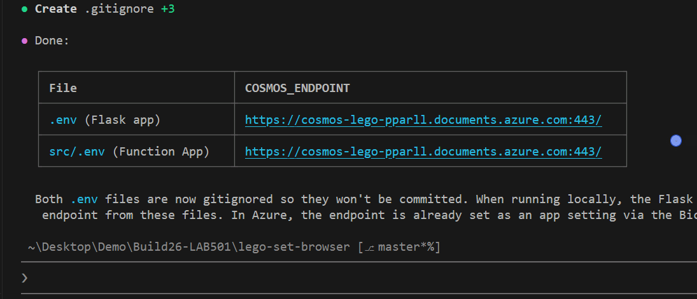


### Ask the copilot to show live deployed app
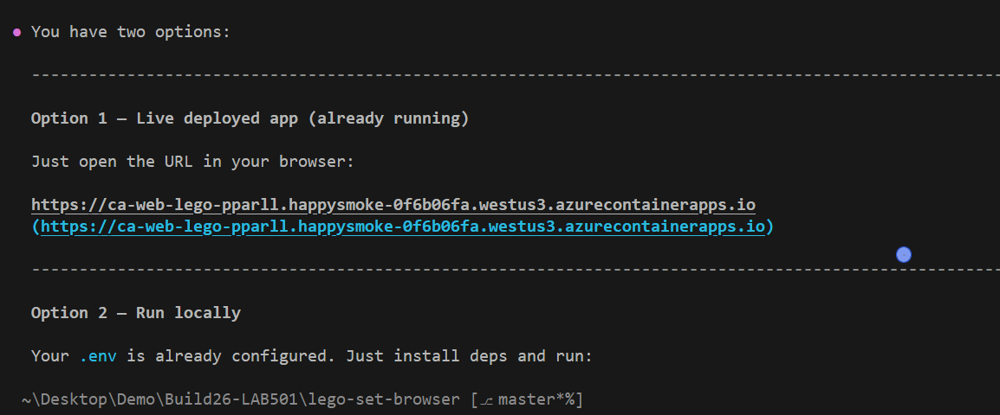
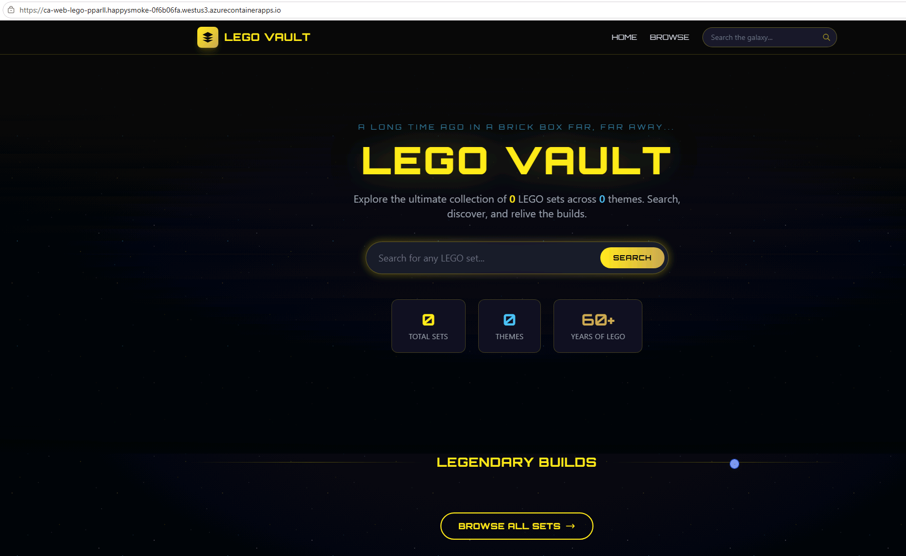

Then instruct the copilot to populate the app with LEGO data
as there were 0 total themse and sets

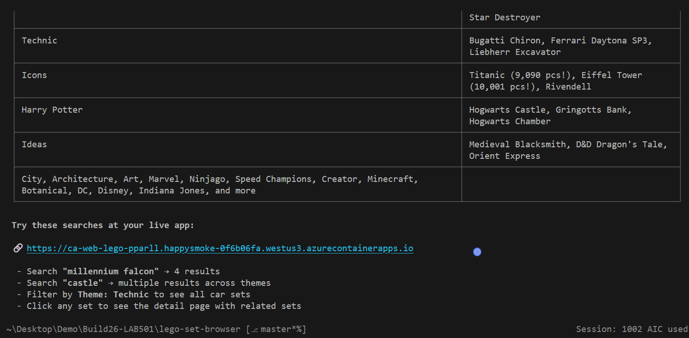

Test the app by searching 'millennium falcon'

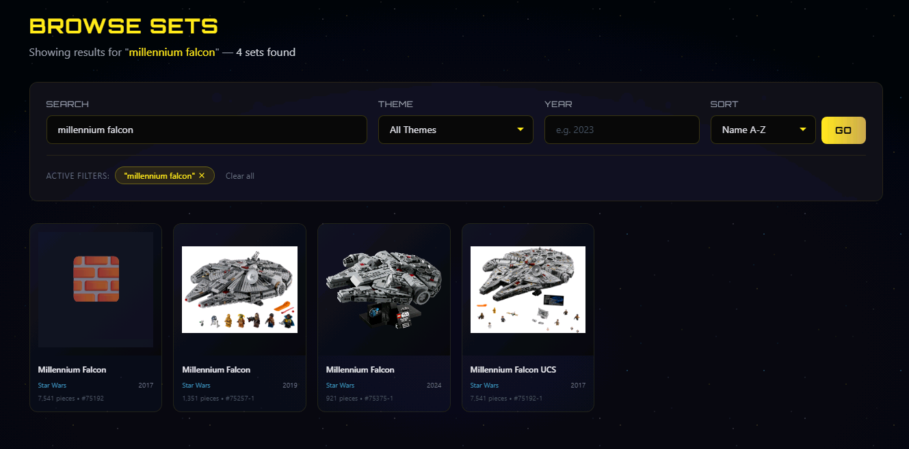

That's it! You have successfully completed the lab.
