Log into the Github Account

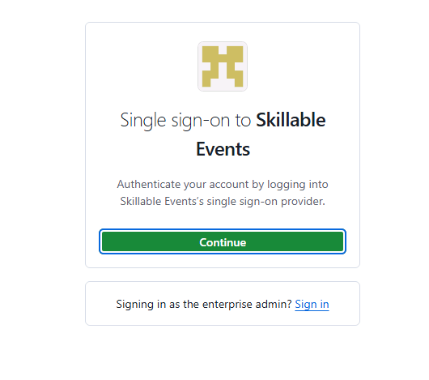
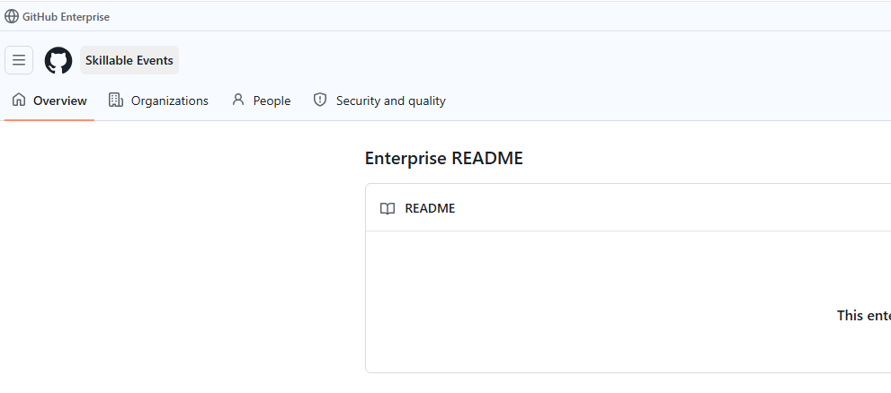
Go to the [private workspace]("https://github.com/Skillable-Events/build26-LAB540") created for you
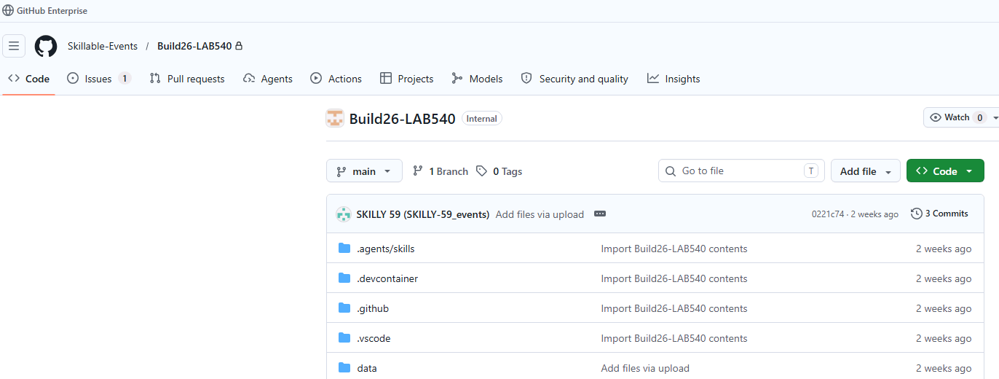


#### Go to Microsoft Foundry and check models

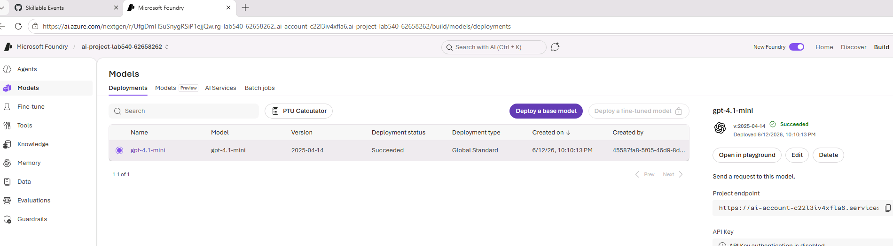


# Open the Codespace

Select the Codespace you want to open

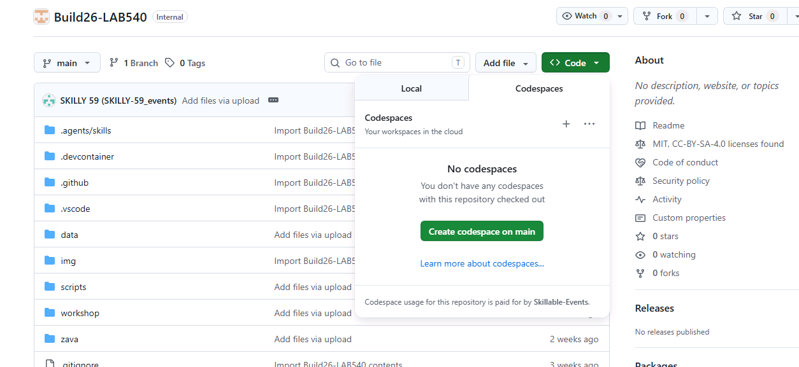

Learning Objectives

In this hands-on lab, we'll see how the Microsoft Foundry Observability platform works with GitHub Copilot and Foundry skills, to simplify the developer experience and accelerate their progress from plan to prototype.

By completing this lab you will learn to:
- Create and deploy a hosted agent using Azure Developer CLI
- Auto-generate test datasets and evaluators using the observe skill
Activate the evaluate-optimize loop to iteratively improve agent
Retrieve and analyze production insights to troubleshoot failures
- Explore new features like adaptive evaluations & optimization service


# Follow core folder for the lab instruction

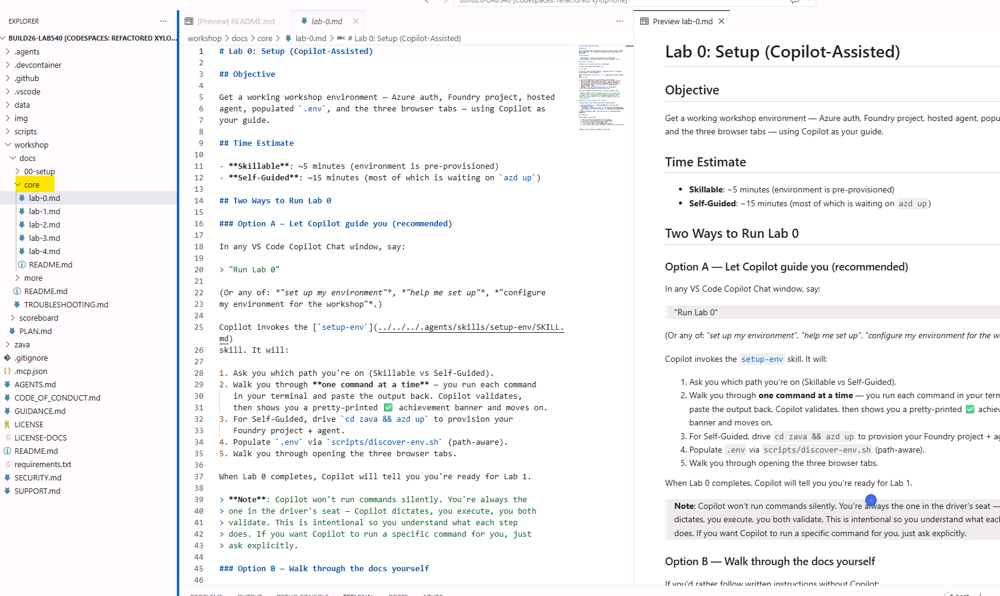

### Lab 0
Now ask copilot to

```
"Run Lab 0"
```

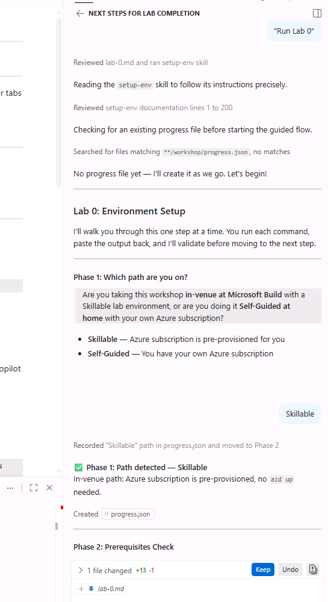
Follow the instructions to run the lab 0.
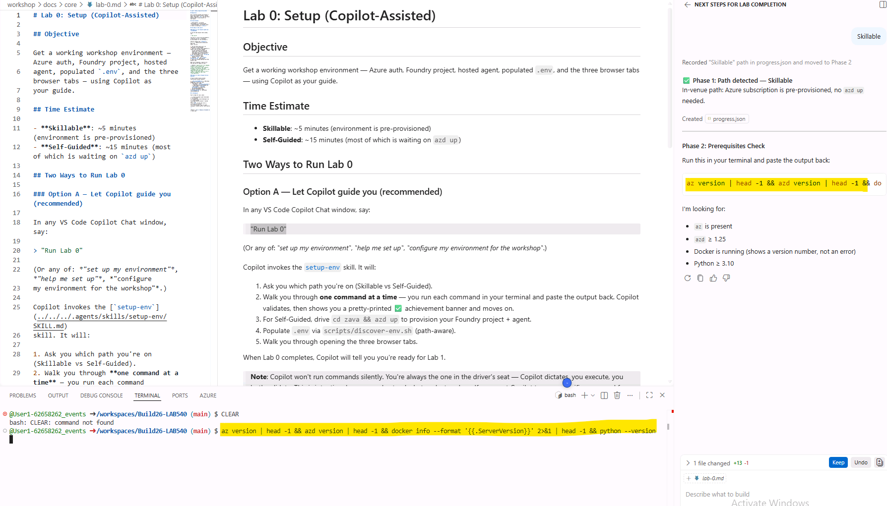

```
az login --use-device-code
az account show --query '{name:name, id:id}' -o table
azd auth login --use-device-code
```
To populate the .env

```
chmod +x scripts/discover-env.sh
./scripts/discover-env.sh
```

Add missing values from Microsoft Foundry (Operate -> Admin)

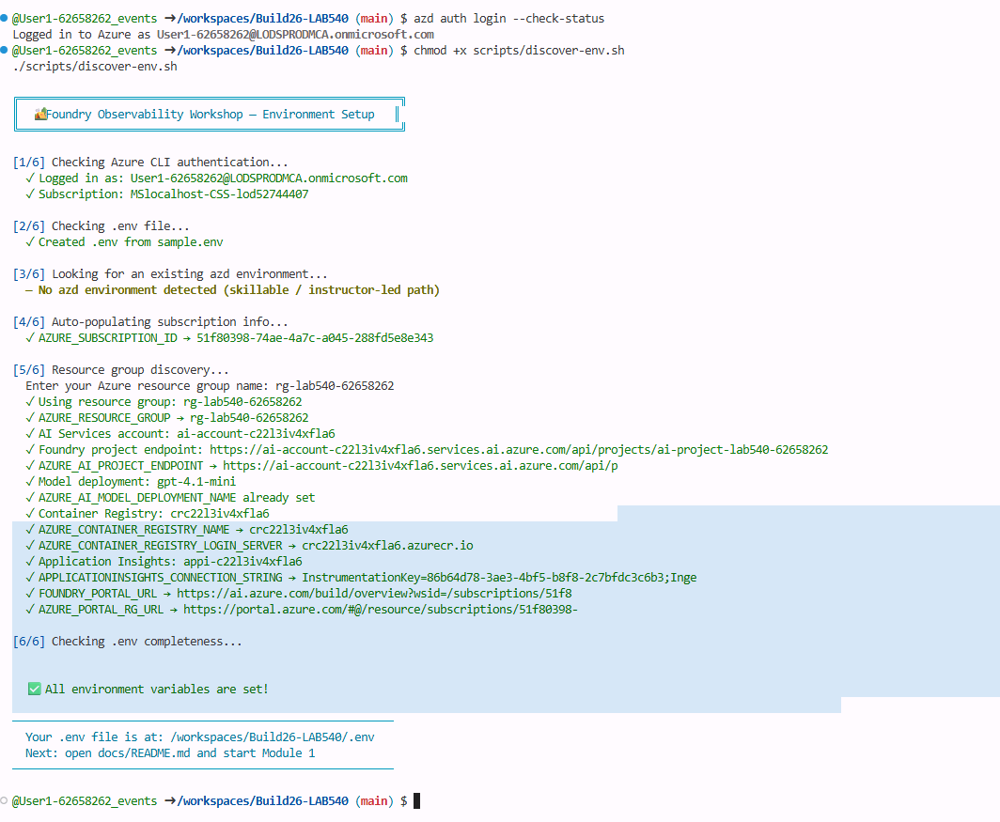

You can also verify the resource group and the foundry account in the Azure portal.

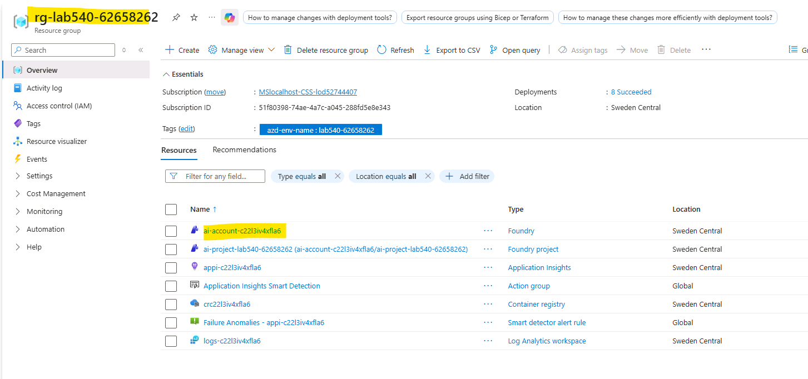

### Lab 1

Now write 

```
Complete Lab 1
```
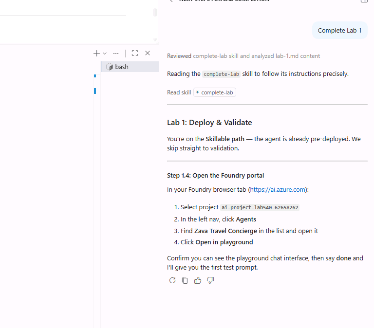


Failure Note: The Zava Travel Concierge is not pre-deployed in the Foundry portal.
